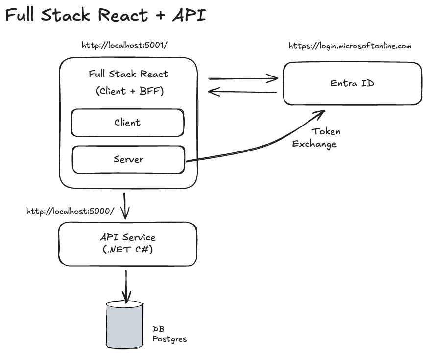

# Architecture

High-level overview of the Tsz monorepo. For folder-level detail and exact APIs, read the code — this doc tracks the shape, not every file.



## Monorepo layout

```bash
tsz/                                  # repo root
├── packages/
│   ├── api/                          # .NET solution (tsz.slnx)
│   │   ├── Tsz.Api/                  # ASP.NET Core minimal-API host + domain modules
│   │   ├── Tsz.Infrastructure/       # Cross-cutting: handlers, repo/UoW, auth, validation
│   │   └── tests/
│   │       ├── Tsz.Api.Tests/                # xUnit unit tests (Moq + Shouldly)
│   │       └── Tsz.Api.Tests.Integration/    # xUnit + WebApplicationFactory
│   └── web/                          # TanStack Start app (React 19, Vite 8)
├── docs/
│   ├── adr/
│   ├── agents/                       # Agent-facing conventions (csharp, typescript)
│   └── product/                      # Architecture + per-module requirements
├── certs/                            # Local dev mkcert certs
├── tsz.slnx                          # .NET solution file
├── package.json                      # Bun workspaces root
└── bun.lock
```

- Monorepo orchestration: **Bun workspaces** (`bun --filter <pkg> <script>`). No npm/pnpm.
- Root tooling: [vite-plus](https://www.npmjs.com/package/vite-plus) (`vp check` wraps OXLint + OXFmt).
- Root scripts of note: `bun dev` (web), `bun dev:api` (`dotnet watch`), `bun test:api`, `bun test:api:int`.

## Frontend — `packages/web`

TanStack Start app served by Vite. SSR + file-based routing + server functions.

**Stack**
- TypeScript (strict), React 19
- [TanStack Start](https://tanstack.com/start) — full-stack framework on top of TanStack Router
- File-based routing via `@tanstack/router-plugin` (auto-generates `routeTree.gen.ts` — never edit by hand)
- Server functions via `createServerFn` for SSR data loading and mutations
- Forms with [TanStack Form](https://tanstack.com/form) + Zod validation
- Styling with [Tailwind v4](https://tailwindcss.com/) (`@import "tailwindcss"`)
- UI components: [shadcn](https://ui.shadcn.com/) primitives under `components/ui/`
- API client: [openapi-fetch](https://openapi-ts.dev/) + TS types generated from the .NET OpenAPI document (`bun --filter web gen:api`)
- Unit tests: Vitest (via `vp test`) + `@testing-library/react` + jsdom
- Lint/format: `vp check` (OXLint + OXFmt)

**Authentication**
- [Better Auth](https://better-auth.com/) on the server (SQLite-backed at `auth.db`)
- Microsoft Entra ID as the OAuth provider; one app registration is shared by the frontend (Better Auth client) and the API (JWT bearer audience)
- The Better Auth handler is mounted at `/api/auth/$` (TanStack Start route)
- Session-aware loaders use `getSession()` in `beforeLoad`; the protected route layout (`routes/_protected.tsx`) gates everything that needs a user

**Folder shape (current)**
```bash
packages/web/
├── public/
├── src/
│   ├── api/                          # API client + generated OpenAPI schema
│   │   ├── client.ts                 # openapi-fetch instance
│   │   ├── schema.ts                 # generated — do not edit
│   │   ├── users.ts                  # client-side calls
│   │   └── users.server.ts           # server-only calls (used by createServerFn)
│   ├── components/
│   │   ├── ui/                       # shadcn primitives (button, input, label, table, …)
│   │   ├── error-boundary.tsx
│   │   └── theme-toggle.tsx
│   ├── lib/
│   │   ├── auth.ts                   # betterAuth() server config
│   │   ├── auth-client.ts            # betterAuth client (browser)
│   │   ├── auth.functions.ts         # server functions: getSession, signOut, …
│   │   ├── api.server.ts             # server-only API helpers (token forwarding)
│   │   ├── current-user.ts
│   │   └── utils.ts                  # cn() helper, etc.
│   ├── routes/
│   │   ├── __root.tsx                # Root layout/shell
│   │   ├── _protected.tsx            # Auth-gated layout
│   │   ├── _protected/
│   │   │   ├── index.tsx             # /
│   │   │   ├── admin.tsx             # /admin layout
│   │   │   └── admin/users/          # /admin/users, /admin/users/new, /admin/users/$id
│   │   ├── api/auth/$.ts             # Better Auth catch-all handler
│   │   └── no-access.tsx
│   ├── router.tsx                    # createRouter setup
│   ├── routeTree.gen.ts              # AUTO-GENERATED
│   └── styles.css                    # @import "tailwindcss";
├── components.json                   # shadcn config
├── vite.config.ts
├── package.json
└── tsconfig.json
```

> Path alias: `#/*` → `./src/*` (see `packages/web/package.json` `imports`).

## Backend — `packages/api`

Two projects in one solution: `Tsz.Api` hosts the web app and the domain modules; `Tsz.Infrastructure` holds all cross-cutting plumbing so domain code stays thin.

**Stack**
- C# 14 / .NET 10
- ASP.NET Core minimal APIs
- Entity Framework Core (SQLite by default — `tsz.db`; connection string is overridable)
- OpenAPI via `Microsoft.AspNetCore.OpenApi`, served with Scalar UI at `/openapi`
- Microsoft Identity Web for JWT bearer validation (Entra ID)
- [FluentValidation](https://docs.fluentvalidation.net/) for command/query input validation
- Tests: xUnit, Moq, Shouldly (unit); `Microsoft.AspNetCore.Mvc.Testing` + `UseInMemoryDatabase` (integration)

**Module-based vertical slice architecture**

Each domain concept is a self-contained module under `Tsz.Api/Modules/<Name>/`. A module owns its entity, EF configuration, DTO(s), endpoint registration, and a `Features/` folder where each operation lives in its own file (command/query + result + validator + handler).

```bash
packages/api/
├── Tsz.Api/
│   ├── Program.cs                    # Composition root: auth, DI, EF, OpenAPI, endpoint mapping
│   ├── Modules/
│   │   └── Users/
│   │       ├── User.cs               # Entity (private setters, static factory, named mutators)
│   │       ├── UserConfiguration.cs  # IEntityTypeConfiguration<User>
│   │       ├── UserDto.cs
│   │       ├── UserRole.cs
│   │       ├── UserEndpoints.cs      # MapApiGroup("users") + per-route mappings
│   │       ├── UserSeeder.cs         # Dev seed via IUnitOfWork
│   │       ├── CurrentUserResolver.cs
│   │       ├── RequireAdminAuthorizationHandler.cs
│   │       └── Features/
│   │           ├── CreateUser.cs     # Command + Result + Validator + Handler
│   │           ├── DeleteUser.cs
│   │           ├── GetCurrentUser.cs
│   │           ├── GetUserById.cs
│   │           ├── GetUsers.cs
│   │           └── UpdateUser.cs
│   ├── Persistence/
│   │   ├── AppDbContext.cs           # No DbSets — schema is composed from IEntityTypeConfiguration<T>
│   │   └── Migrations/
│   └── appsettings*.json
└── Tsz.Infrastructure/
    ├── Abstractions/                 # ICommand, ICommandHandler, IQuery, IQueryHandler,
    │                                 # IRepository, IUnitOfWork, IEntityBase, IEntityDto
    ├── Persistence/                  # EfCoreRepository<T>, EfCoreUnitOfWork<TContext>
    ├── Auth/                         # ICurrentUser, HttpContextCurrentUser, AuthorizationPolicies,
    │                                 # RequireAdminRequirement
    ├── Endpoints/                    # MapApiGroup() extension
    ├── Extensions/                   # AddInfrastructure<TContext>(), AddHandlersFromAssembly()
    └── Validation/                   # ValidationFilter<TRequest> endpoint filter
```

**Conventions**
- Endpoints depend only on `ICommandHandler<,>` / `IQueryHandler<,>` — handlers are auto-registered from the assembly by `AddHandlersFromAssembly`.
- All data access goes through `IUnitOfWork` + `IRepository<T>`. `AppDbContext` has no `DbSet<T>` properties; entities are wired in via their `IEntityTypeConfiguration<T>` (auto-discovered) so modules stay self-contained.
- Validation: write commands attach `AddEndpointFilter<ValidationFilter<TCommand>>()` and provide an `AbstractValidator<TCommand>`. Validators are picked up by `AddValidatorsFromAssembly`.
- Authorization: a fallback policy requires an authenticated user; admin-only endpoints opt into `AuthorizationPolicies.RequireAdmin` (custom `RequireAdminRequirement` + handler resolves the current user via `ICurrentUser` / `ICurrentUserResolver`).
- Database: `db.Database.Migrate()` runs at startup; in `Development` the relevant module seeder (e.g. `UserSeeder`) runs through `IUnitOfWork`.
- OpenAPI: a schema transformer marks non-nullable properties as `required` so the generated TS schema omits `?`, and strips the spurious `string` type that `JsonNumberHandling.Strict` adds to numeric schemas.

**Testing**
- Unit tests (`Tsz.Api.Tests`): handler/validator tests with Moq'd `IUnitOfWork` / `IRepository<T>`, Shouldly assertions, per-entity `Builders/` for fixture data.
- Integration tests (`Tsz.Api.Tests.Integration`): xUnit + `WebApplicationFactory` with `UseInMemoryDatabase` per fixture, `TestAuthHandler` to bypass `[Authorize]`. All DB access through `IUnitOfWork` — no direct `AppDbContext`.

## End-to-end contract flow

1. Define / change an endpoint in a module's `Features/` folder and register it in the module's endpoints file.
2. Build the API.
3. Regenerate the TS schema: `bun --filter web gen:api` (reads `https://localhost:7215/openapi/v1.json`).
4. Frontend consumes the new types via the `openapi-fetch` client in `packages/web/src/api/`.

## Cross-cutting

- **Local HTTPS:** mkcert-signed certs under `certs/`. Node needs `--use-system-ca` to trust them (already wired into `bun --filter web dev`).
- **Databases (dev):** SQLite — `packages/api/Tsz.Api/tsz.db` (API) and `packages/web/auth.db` (Better Auth). Both use WAL mode.
- **CI / scripts:** `bun check` runs OXLint + OXFmt across all workspaces; `bun typecheck` runs `tsc --noEmit`; `bun test:api` / `bun test:api:int` run the .NET test suites.
