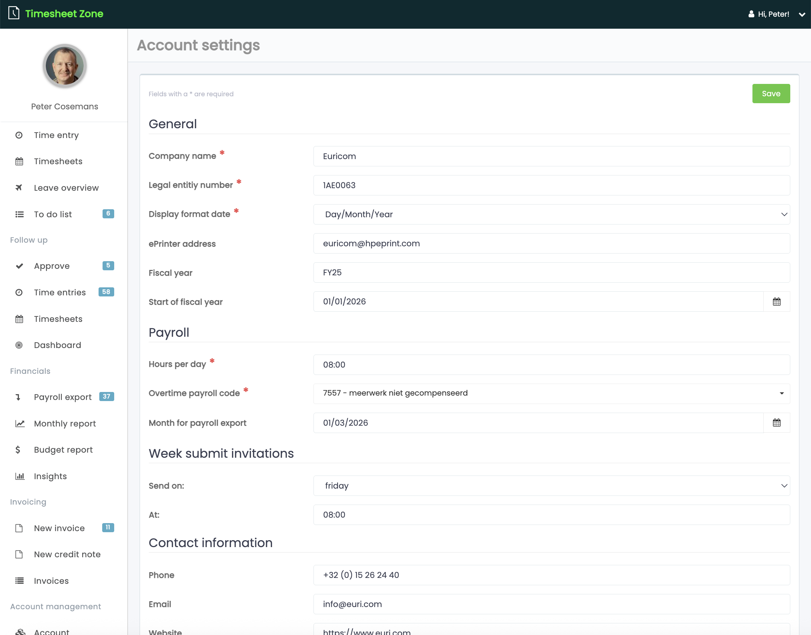

# Requirements

The main goal of this application is to provide a platform for time tracking and leave management for Euricom.

## User features

- [Login](./requirements/login/login.md)
- [Time Entry](./requirements/time-entry/time-entry.md)
- [Timesheets](./requirements/timesheets/timesheets.md)
- [Leave Overview](./requirements/leave-overview/leave-overview.md)

## Admin features

To enter time entries you need:

- [Customers](./requirements/customers/customers.md) & [Contracts](./requirements/contracts/contracts.md) (with related tasks)
- [Leave Types](./requirements/leave-types/leave-types.md) (holiday, sick leave, holiday replacement, etc.)

To manage the users and their settings:

- [Users](./requirements/users/users.md) (name, email, role, etc.) and their user settings (leave types, working hours, etc.)

