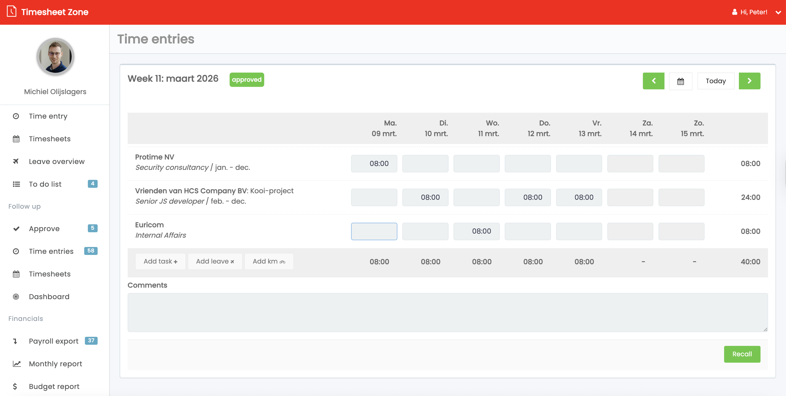

# Time Entry

**Prio 1:**

- Time entries are per week
- Add a task from a list (based on the contract and the customer). A task present a row in the time entry table.
- Add a leave from a list (based on the allowed leave types for a user). A leave present then a row in the leave overview table.
- You can select multiple tasks and leaves per week.
- You can enter a time (00:15 - 8:00) for a task.
- You can us following hot-keys (d: full day, h: half day, del: empty field)
- The week-end and holidays are not editable
- A total time per task/leave is calculated
- A total time per day and week is calculated
- You can navigate to the previous and next week and choose a date in the calendar or 'today'
- When navigating away from the time entry page or week is changed, the time entries are saved automatically
- You can submit the week for approval (week will be marked as 'approved)

**Out of Scope:**

- Add km
- Comments

